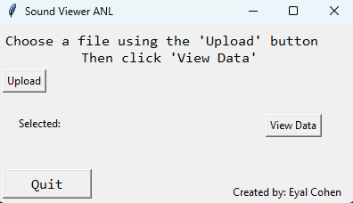
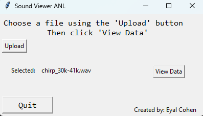
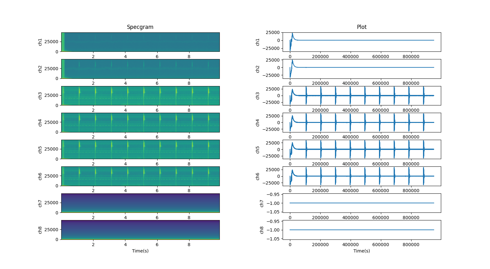
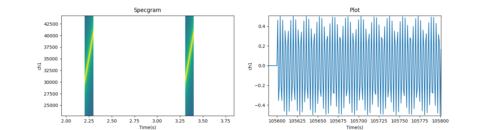

# plotWavApp_v1.py

This script is designed to conveniently display `.wav` files with one or more channels of input. It supports a simple, user-friendly interface.

## How it works

1. Run `plotWavApp_v1.py` in your local IDE or command line.
2. Click the `Upload` button.
   - Choose the `.wav` file you want to view.

   

3. Click `View Data` to display the waveform.

   

You can also analyze `.wav` files with multiple channels. Here's an example of an 8-channel recording, with 4 active channels, 2 silent, and 2 echo channels:

   

You can also analyze single-channel signals like the chirp generated by `signal_generator.py`, as shown below:

   

---

# signal_generator.py

This script is designed to conveniently create `.wav` files (currently command-line version). The user can choose from three types of signals:
- chirp - A normal chirp (single or repetitive)
- cw - Continuous wave (single or repetitive)
- cwinc - Continuous wave that increments frequency every x pulses (currently, the only available step of incrementation is +1 kHz)

## How it works

1. Run `signal_generator.py` in your local IDE or command line.
2. Follow the on-screen instructions:
   - Enter the sample rate (in kHz).
   - Input the starting frequency (in kHz).
   - Input the ending frequency (in kHz).
   - Specify the signal duration (in seconds).
   - Specify the silence duration between signals (in seconds).
   - Set the repeat value (an integer for the number of times the signal is repeated at each frequency).

3. The script will generate `.wav` files. Here's an example of a generated 1-channel chirp signal:

   

Once generated, this signal can be analyzed and visualized using `plotWavApp_v1.py`, as shown in the next section.
